# RuneTags

<sub><b>[</b> Quick-Cards for PlayerProfile <b>]</b></sub>

<p align="center">
  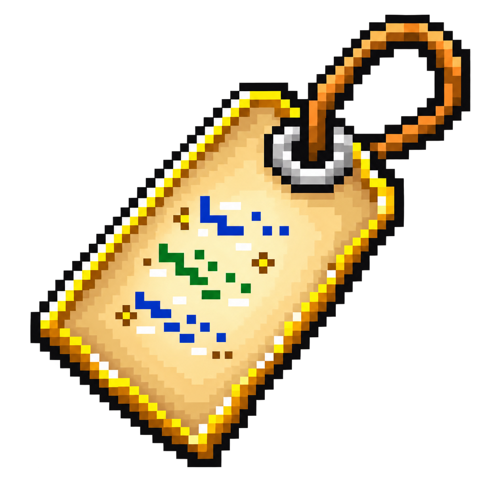
</p>

> **RuneTags** is a RuneLite plugin built around a powerful quick-card profile system for Old School RuneScape players.
>
> Instantly view player information directly from chat, mentions, or player interactions. RuneTags combines player identity, personal notes, tags, favorites, history, account information, activity context, reports, and statistics into one unified profile.
>
> Whether you are managing a clan, organizing raids, meeting new players, or simply trying to remember "who was that person?", RuneTags turns player names into meaningful profiles.

<p align="left">
  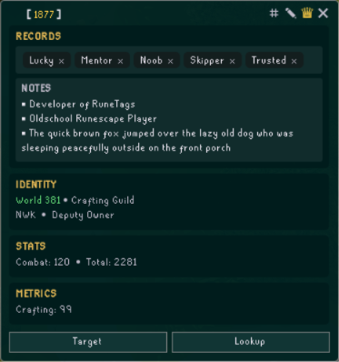
</p>

---

## PlayerProfile Quick-Cards

The Quick-Card is the center of RuneTags, displaying available player information and personal records in one profile.

Quick Profiles provide a centralized view of player information into sections:
```
[ICON] PlayerName                    (TAGS) (NOTE) (FAVORITE) (CLOSE)

├─ Current RSN
│  └─ Previous RSNs
│
├─ Records
│  ├─ Tags
│  ├─ Notes
│  └─ RuneWatch Cases
│
├─ Identity
│  ├─ Status / World • Location
│  └─ Party or Clan or Channel • Rank
│
├─ Stats
│  ├─ Combat • Total Level
│  └─ Account Build (Coming Soon)
│
├─ Metrics
│  ├─ EHP • EHB
│  └─ Skill / Boss KC
│
├─ Recent (Coming Soon)
│  └─ Achievement / Gain
│
└─ [Target] • [Lookup]
```

---

## Records

RuneTags stores personal player information locally.

<p align="left">
  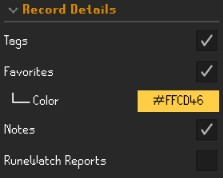
</p>

Records include:

### Tags (#)
Add up to five (5) unique labels to each player.

<p align="left">
  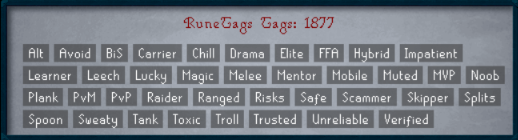
</p>

### Notes (✎)
Store personal reminders or context.

<p align="left">
  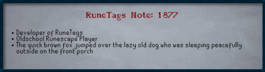
</p>

### Favorites (♕)

Mark important players for quick identification.

Favorites are available throughout RuneTags features, including:

- Player highlighting
- Chat highlighting
- Player profiles
- Mention History

<p align="left">
  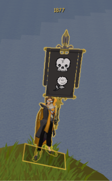
</p>

### Report Cases (⚠)

Display available player report information from both RuneWatch and WeDoRaids:

Profiles can display:

- Case count
- Case identifiers
- Report summaries
- Evidence ratings

<p align="left">
  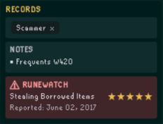
</p>

---

## Identity

Player identity is built from information RuneTags has observed or received from available sources.

Identity information includes:

- Account Type (Normal, Ironman, et cetera)
- Current + Previous RSNs
- Status + World
- Location
- Friends/Clan/Guest Chat-Channels
- Rank Information

<p align="left">
  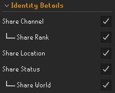
</p>

### Account Information

RuneTags recognizes RuneScape account classifications.

Supported account types include:

- Normal
- Ironman
- Hardcore Ironman
- Ultimate Ironman
- Group Ironman
- Hardcore Group Ironman
- Unranked Group Ironman
- Deadman
- Leagues
- Player Moderator
- Jagex Moderator

Account icons are displayed alongside player identities where applicable.

### Status

Displays online/offline status when RuneTags has access to a current player source (i.e., Guest Clan Chat Updates).

<p align="left">
  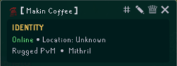
</p>

### World

Displays the players current world when RuneTags has access to a current player source (i.e., Clan Chat Updates).

<p align="left">
  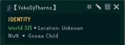
</p>

### Location

Displayed <u>only</u> if you're both in the same Party.

<p align="left">
  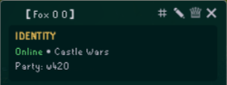
</p>

### Previous RSNs

RuneTags tracks historical player names, which you've personally observed (i.e., Friends List updates).

Previous names are stored as historical information and are not treated as automatic lookup aliases.

<p align="left">
  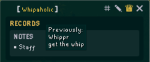
</p>

---

## Stats

Player statistics provide quick account context.

Current information:

- Combat level.
- Total level.

<p align="left">
  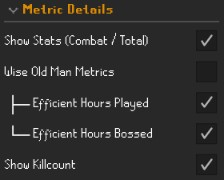
</p>

<b>Future Expansion v3.5</b>: 

- Account build classification (e.g., 1-Defence Pure).

---

## Metrics

RuneTags can display efficiency and progression information.

Available metrics:

- EHP (Efficient Hours Played) + EHB (Efficient Hours Bossing)
- Skill Levels + Boss Killcounts

<p align="left">
  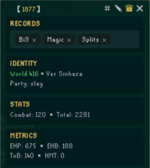
</p>

<b>Future Expansion v2.0</b>:

- Instanced-area detection (e.g., Olm for CoX) for activity context. 
- Object-detection (e.g., Anvil for Smithing) activity context.

---

## Recent Activity (Coming Soon)

Future Expansion v3.0 will display recent player milestones:

- Achievements
- Level gains
- Progression events

---

# Player Actions

The PlayerProfile card provides quick actions:

- Target players
- Lookup players

## Targeting

RuneTags provides nearby player targeting directly from both the card and chat interactions.

<p align="left">
  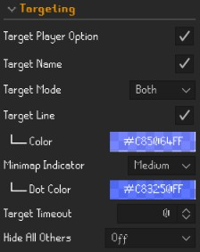
</p>

## Lookup

Search a player on three (3) different providers: HiScores, WiseOldMan, and RuneProfile.

<p align="left">
  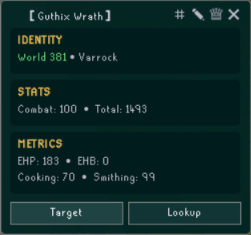
</p>

---

# Mentions & Tags

RuneTags detects player names and `@tags` inside chat messages and makes them interactive.

<p align="left">
  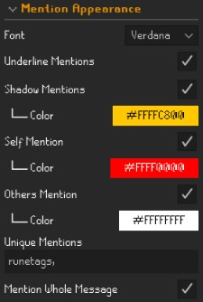
</p>

<p align="left">
  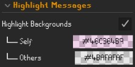
</p>

<p align="left">
  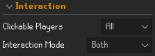
</p>

Supported interactions include:

- Sender chat references
- Player mentions
- Explicit `@tags`
- Mention History tab
- Right-click player interaction menu
- Player-aware suggestions while typing tags

<p align="left">
  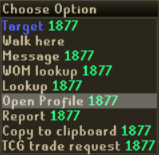
</p>

<p align="left">
  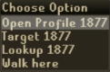
</p>

## Mention Notifications

Never miss when someone references you.

RuneTags can notify you when:

- Someone mentions your name.
- Someone uses your configured tags.
- Important player references appear.

Notification behavior can be configured.

<p align="left">
  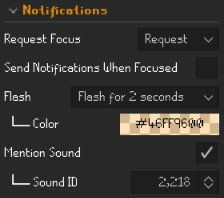
</p>

## Mention History

RuneTags maintains a searchable history of local player references.

History includes:

- Players who mentioned you.
- Message snapshot containing tracked references.
- Historical player interactions.

<p align="left">
  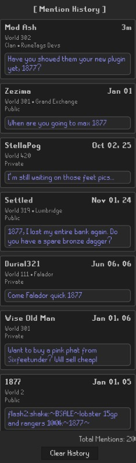
</p>

<p align="left">
  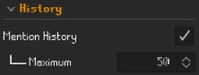
</p>

---

# Chat Integration

RuneTags integrates with the RuneScape chatbox while preserving the native experience.

Supported chat interactions include:

- Public chat.
- Private messages.
- Friends Chat.
- Clan Chat.
- Guest Clan Chat.
- Game messages.
- System messages.

RuneTags tracks player references through chat while preserving RuneScape formatting, icons, and message structure.

## Suggestions & Autocomplete

Additionally, RuneTags makes it easier to reference players by providing context-aware suggestions while creating tags and interacting with player names.

Suggestions help bridge the gap between remembering a player and opening their PlayerProfile.

<p align="left">
  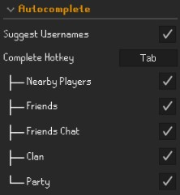
</p>

Supported suggestions include:

- Nearby player presence
- Friends list
- Friends chat
- Clan/Guest chat relationships
- Party context

<p align="left">
  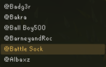
</p>

Suggestions are designed to quickly identify the correct player while avoiding unnecessary typing or searching. After typing the `@` symbol and 2+ characters, you will see up to six (6) suggestions. Using the up/down arrows, you may select a username, then autocomplete with the appropriate `<TAB>` Complete Hotkey.

---

# Why RuneTags?

RuneScape communities rely heavily on player names.

Whether you are:

- Running raids
- Managing a clan
- Tracking friends
- Organizing events
- Reviewing player history
- Remembering important interactions

RuneTags turns player names into useful information without leaving the game.

Instead of remembering:

> "Who was that player?"

RuneTags helps answer:

> "Who is this player, and why do I recognize them?"

---

# Roadmap

## Version 2.0

Expand contextual awareness through object and instanced-area detection.

Examples:

- Player Owned House activity
- Inside ToA, ToB, or CoX
- Nearby smithing locations
- Activity-based player context

## Version 3.0

Recent player achievements and gains.

- Recent level-ups
- Achievement milestones
- Progression events

## Version 3.5

- Account Build profile information

## Version 4.20

### RuneTags API expansion.

Potential features:

- Mailbox
- Friends
- Expose/share player details across RuneTags

---

# Feedback

If you encounter an issue, please open a GitHub issue and include:

- RuneLite version
- RuneTags version
- Screenshot of the issue
- Steps to reproduce
- Relevant configuration settings

For profile or chat issues, please include:

- The affected player name
- The chat message involved
- Whether the player was nearby, in a party, or remote (Friends Chat/Clan/Guest Clan)
- A screenshot showing the full chat/profile area

---

# Disclaimer

RuneTags is a third-party RuneLite plugin and is not affiliated with, endorsed by, or sponsored by Jagex Ltd. or the RuneLite project.

Old School RuneScape and RuneScape are trademarks of Jagex Ltd.